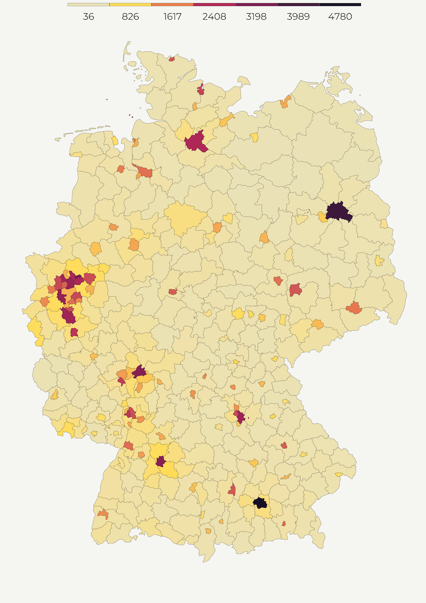
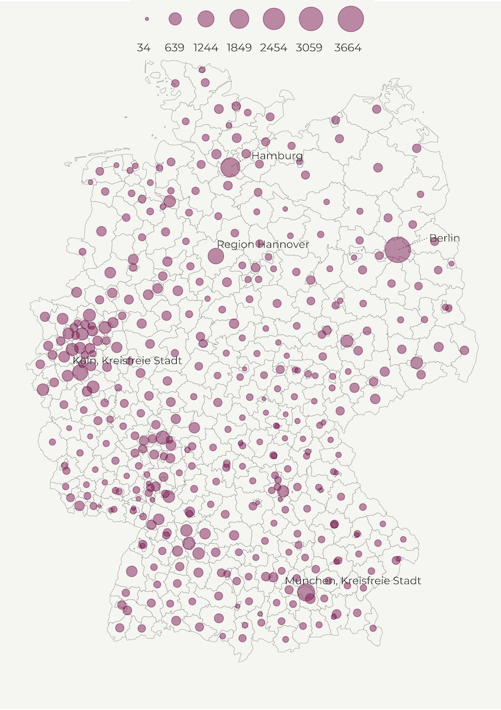
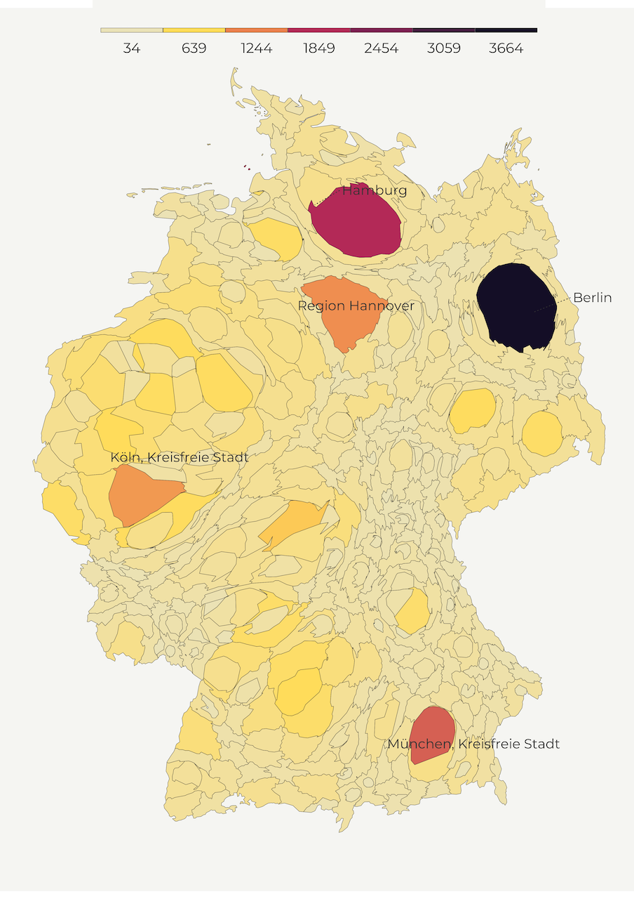
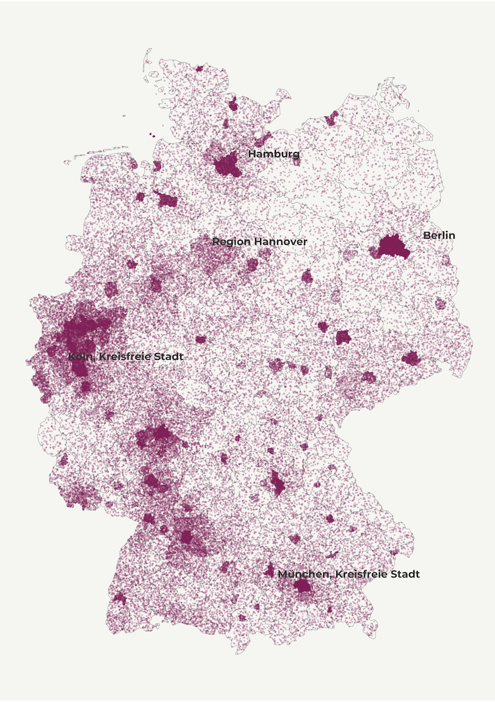

Our world has reached 8 billion people last November, according to the United Nations! 😯 And <a href="https://www.un.org/en/desa/world-population-projected-reach-98-billion-2050-and-112-billion-2100" target="_blank" rel="noopener noreferrer">this</a> report expects world to become a host to nearly 10 billion people by 2050, and over 11 billion in 2100. In the coming years, the growth will be concentrated in 9 countries in Africa, Americas and Asia.

In this tutorial, I'll show you 5 easy ways to map population with <span class="highlight">R</span>. Mapping population comes in different forms and it's one of the most popular topics on social media. Some would even argue that nearly every map is a population map. If I had a penny for every time this popped up in my feed, I'd be filthy rich 😁.

Anyways, we'll use Eurostat's latest population data on the <a href="https://www.destatis.de/Europa/EN/Methods/Classifications/OverviewClassification_NUTS.html" target="_blank" rel="noopener noreferrer">NUTS3</a> level (caveat reader, it's not what you think) to map the population of Germany🇩🇪. These data are organized on the regional level, allowing us to chart out the within-country variation.

 We start off with several standard techniques such as polygons, points and cartogram and conclude with coooler alternatives such as the dot-density plot and spike map.


Buckle up, this is goin to be a long one!


## Load packages

In this tutorial, we first summon several essential packages: <span class="highlight">tidyverse</span> and <span class="highlight">sf</span> for spatial analysis and data wrangling; package <span class="highlight">classInt</span> will help us construct a fine breaks based on Jenks natural interval; <span class="highlight">cartogram</span> package assists us in creating pretty cartogram maps while <span class="highlight">rayshader</span> is instrumental for making spike maps, which we have already used <a href="https://milospopovic.net/3d-maps-with-r/" target="_blank" rel="noopener noreferrer">here</a>; finally, we'll use <span class="highlight">giscoR</span> and <span class="highlight">eurostat</span> library to import Eurostat boundaries and data into <span class="highlight">R</span>.

```r
# libraries we need
libs <- c(
    "tidyverse", "sf", "classInt", 
    "cartogram", "rayshader",
    "giscoR", "eurostat"
)

# install missing libraries
installed_libs <- libs %in% rownames(installed.packages())
if (any(installed_libs == F)) {
    install.packages(libs[!installed_libs])
}

# load libraries
invisible(lapply(libs, library, character.only = T))
```

## Defining constants

Since this tutorial will cover 5 techniques let's lay the foundations for our tutorial. First, we define the base projection, longlat, which we will use throughout the tutorial, and Lambert projection that will come in handy when we make the cartogram.


```r
# CONSTANTS
#------------
# define projections
# longlat
crsLONGLAT <- "+proj=longlat +datum=WGS84 +no_defs +ellps=WGS84 +towgs84=0,0,0"
# Lambert
crsLAEA <- "+proj=laea +lat_0=52 +lon_0=10 +x_0=4321000 +y_0=3210000 +datum=WGS84 +units=m +no_defs"
```

Second, we create our own <span class="highlight">ggplot2</span> theme to avoid repetition. We opt for a minimal appearance with a subtle beige background and the horizontal legend placed on the top of the graph and all that wrapped into a function under magnificent name <span class="highlight">theme\_for\_the\_win</span>.  

```r
# ggplot2 theme
theme_for_the_win <- function() {
    theme_minimal() +
        theme(
            text = element_text(family = "Montserrat"),
            axis.line = element_blank(),
            axis.text.x = element_blank(),
            axis.text.y = element_blank(),
            axis.ticks = element_blank(),
            axis.title.y = element_blank(),
            legend.position = c(.5, .99),
            legend.text = element_text(size = 60, color = "grey20"),
            legend.title = element_text(size = 70, color = "grey20"),
            legend.spacing.y = unit(0.25, "cm"),
            panel.grid.major = element_blank(),
            panel.grid.minor = element_blank(),
            plot.margin = unit(
                c(t = 0, r = 0, b = 0, l = 0), "lines"
            ),
            plot.background = element_rect(fill = "#f5f5f2", color = NA), 
            panel.background = element_rect(fill = "#f5f5f2", color = NA), 
            legend.background = element_rect(fill = "#f5f5f2", color = NA), 
            panel.border = element_blank(),
        )
}
```

Finally, we use customized colorblind-friendly color palette with vivid colors.

```r
# colors
cols <- rev(c(
    "#140e26", "#451a40",
    "#7d1d53", "#b32957", "#ccaead",
    "#eb804e", "#ffdc58"
))
```

## Fetch population data


Eurostat collects info on population for EU/EEA and EU candidate countries as well as appropriate administrative boundaries for mapping purposes.

In the following code, we import the shapefile of Germany on the NUTS3 level. Note that we use ISO2 code "DE" to retrieve the subnational boundaries of Germany but you could choose other countries instead. For the full list of available countries check <a href="https://ec.europa.eu/eurostat/statistics-explained/index.php?title=Glossary:Country_codes" target="_blank" rel="noopener noreferrer">this</a> one out!


```r
# get NUTS3 shapefile
deu_nuts3 <- giscoR::gisco_get_nuts(
    year = "2021",
    epsg = "4326",
    resolution = "3",
    nuts_level = "3",
    country = "DE"
)
```

We easily access population <a href="https://ec.europa.eu/eurostat/databrowser/view/demo_r_pjangrp3/default/table?lang=en" target="_blank" rel="noopener noreferrer">data</a> using the chunk below. We consider total population count for all ages in Germany and latest available year. 

```r
# get population data
pop_df <- eurostat::get_eurostat("demo_r_pjangrp3",
    time_format = "num"
) |>
    dplyr::filter(
        sex == "T" &
            unit == "NR" &
            age == "TOTAL" &
            grepl("DE", geo) &
            time == 2021
    ) |>
    dplyr::select(geo, values)

names(pop_df)[1] <- "NUTS_ID"
```

Finally, we merge Germany's subnational boundaries and population data.frame into a single object.


```r
# merge shp and data.frame
df <- deu_nuts3 |>
    left_join(pop_df, by = "NUTS_ID")
```

We are ready to start mapping!

## Choropleth map

One of the most common ways of mapping population density is a choropleth map. Choropleth maps are thematic maps composed of colored, shaded or patterned polygons that show quantity of a feature. For example, below we create the population density map of Germany with light-colored regions showing lower, and dark-colored regions displaying higher density. This is an intuitive way of presenting densely populated areas because you can easily associate color values with specific geographic areas.


Since regions vary by size, choropleth maps work best when the measurement is adjusted to a notionally common scale (i.e. ratios, percentages). In our case, we adjust population count by territorial size to compute population per square kilometer. Using <span class="highlight">sf::st\_area</span> we calculate the size of every polygon and divide population count by its area size.

```r
# 1. POLYGONS
#------------
get_polygon <- function() {
    # st_area returns square meters so we get square km by dividing the result by 1000
    df$area_sqkm <- as.numeric(sf::st_area(df) / 1000000)

    deu_polygon <- df |>
        dplyr::mutate(pop_per_sqr_km = values / area_sqkm)

    return(deu_polygon)
}

deu_polygon <- get_polygon()
```

We define the breaks for our map based on equally sized data points and insert the minimum and maximum values at the beginning and end of the vector, respectively.

```r
# min/max values
vmin <- min(deu_polygon$pop_per_sqr_km, na.rm = T)
vmax <- max(deu_polygon$pop_per_sqr_km, na.rm = T)

# bins
brk <- round(classIntervals(deu_polygon$pop_per_sqr_km,
    n = 6,
    style = "equal"
)$brks, 0) |>
    head(-1) |>
    tail(-1) |>
    append(vmax)

# breaks
breaks <- c(vmin, brk)
```
In the final step, we pass our polygon object to <span class="highlight">geom\_sf</span> and specify legend limits and breaks. Notice that we pass the fill option to aesthetics in order to paint the interior of our polygons. We set the color option to constant value to delineate the boundaries of our polygons.

```r
make_polygon_map <- function() {
    p1 <-
        ggplot(deu_polygon) +
        geom_sf(aes(fill = pop_per_sqr_km),
            color = "grey20",
            size = .1
        ) +
        scale_fill_gradientn(
            name = "",
            colours = cols,
            breaks = breaks,
            labels = round(breaks, 0),
            limits = c(vmin, vmax)
        ) +
        guides(fill = guide_legend(
            direction = "horizontal",
            keyheight = unit(1.15, units = "mm"),
            keywidth = unit(15, units = "mm"),
            title.position = "top",
            title.hjust = 0.5,
            label.hjust = .5,
            nrow = 1,
            byrow = T,
            reverse = F,
            label.position = "bottom"
        )) +
        theme_for_the_win() +
        labs(
            y = "",
            subtitle = "",
            x = "",
            title = "",
            caption = ""
        )
    return(p1)
}

map1 <- make_polygon_map()

```

Hurray, here is the polygon map! 😍



## Bubble map

Another common way to display population density is a bubble map. Similar to choropleth maps, bubbles visualize the size of geographic coordinates or larger geographic units. In our case, we will use circles to represent regions. Every circle is going to be centered on their respective region to show population size. 

This helps us reduce the bias caused by different area size in choropleth maps where big regions tend to steal our attention. So, intsead of population per square kilometer we use population count. For simplicity's sake, we transform it to thousands and define the limits and breaks.

```r
# 2. POINTS
#-----------
# normalize population size
df$pop_1000s <- df$values / 1000

# min/max values
vmin <- min(df$pop_1000s, na.rm = T)
vmax <- max(df$pop_1000s, na.rm = T)

# bins
brk <- round(classIntervals(df$pop_1000s,
    n = 6,
    style = "equal"
)$brks, 0) |>
    head(-1) |>
    tail(-1) |>
    append(vmax)

# breaks
breaks <- c(vmin, brk)
```

Then we create centroids for every region; we'll draw circles around them in a bit.

```r
deu_points <- df |>
    sf::st_centroid()
```
But first, let's create the data.frame with lebels for the most populated regions in Germany. We create a table with longitude/latitude values based on the centroids, and include region names. Finally, we order the population count in descending order so that we can filter the first few rows.

```r
deu_coords <- deu_points |>
    dplyr::mutate(
        long = unlist(map(geometry, 1)),
        lat = unlist(map(geometry, 2))
    ) |>
    dplyr::select(NAME_LATN, long, lat, pop_1000s) |>
    sf::st_drop_geometry() |>
    dplyr::as_tibble() |>
    dplyr::arrange(desc(pop_1000s))

```

We will use <span class="highlight">ggrepel</span> to label top 5 most populous German regions. In the function below, we define several options such as the label color and size; family font as well as the size and the placement of the callout line. We also slightly til the labels in order to make the names visible in the sea of points. Feel free to toy with these options!


```r
# function for labelling regions
label_regions <- function() {
    ggrepel::geom_text_repel(deu_coords[1:5, ],
        mapping = aes(x = long, y = lat, label = NAME_LATN),
        colour = "grey20",
        family = "Montserrat",
        size = 20,
        segment.colour = "grey20",
        segment.alpha = .9,
        segment.linetype = 3,
        segment.size = .25,
        nudge_x = .95,
        nudge_y = .15,
        direction = "x"
    )
}

```

Finally, we are ready to create the bubble map! We also use polygons in the background though some of you may want to remove this line. Next, we use the size as the main aesthetics feature as select a color from our palette. 

Another option would be to define color as the aesthetics feature and use the whole palette. But be mindful that the colors might not correspond to the point sizes since we use a continuous scale and the two features can vary independently of each other. 

In the current setup, we also manually decrease the alpha value of our points to 0.5 to create transparent bubbles. This is a good practice if you have multiple overlapping points.

```r
make_point_map <- function() {
    p2 <-
        ggplot() +
        geom_sf(
            data = deu_polygon,
            fill = "transparent",
            color = "grey20",
            size = .1
        ) +
        geom_sf(
            data = deu_points,
            mapping = aes(
                size = pop_1000s,
                geometry = geometry
            ), color = cols[5],
            alpha = .5
        ) +
        label_regions() +
        scale_size(
            breaks = breaks,
            range = c(1, 10),
            labels = round(breaks, 0),
            limits = c(vmin, vmax),
            name = ""
        ) +
        guides(
            color = "none",
            size = guide_legend(
                direction = "horizontal",
                title.position = "top",
                title.hjust = 0.5,
                label.hjust = 0,
                nrow = 1,
                byrow = F,
                reverse = F,
                label.position = "bottom"
            )
        ) +
        theme_for_the_win() +
        labs(
            y = "",
            subtitle = "",
            x = "",
            title = "",
            caption = ""
        )
    return(p2)
}

map2 <- make_point_map()

```

Aaaand, this our bubble map! 😍



## Cartogram

So far, we created maps with regular shapes but cartograms do the opposite. A cartogram is the type of map that distorts the shape of polygon to depict the quantity of a feature. Higher quantity goes hand in hand with enlarged polygons while smaller values correspond to shrinking geometries. This helps us minimize the tendency to attach more importance to territorially greater areas. 

There are several types of cartograms such as contiguous, non-contiguous, and graphical. In the following lines, we mainly focus on contiguous cartograms. We use a convenient <span class="highlight">cartogram</span> package that creates the distortion with a blink of an eye. We only need to pass the weights (<span class="highlight">pop\_1000s</span> feature) as well as the number of iterations for the cartogram algorythm. One thing to keep in mind is that this package doesn't work with the coordinate reference systems based on degrees so you first need to transform your shapefile into another system. 

  

```r
# 3. CARTOGRAM
#-------------

get_cartogram <- function() {
    deu_cart <- df |>
        sf::st_transform(crs = crsLAEA) |>
        cartogram::cartogram_cont(
            weight = "pop_1000s",
            itermax = 5
        ) |>
        sf::st_transform(crs = crsLONGLAT)
    return(deu_cart)
}

deu_cart <- get_cartogram()
```

And, we are ready to map! Interestingly, the code doesn't differ from the one where we used polygons. We just pass the modified cartogram object into <span class="highlight">geom\_sf</span> and define the usual <span class="highlight">ggplot2</span> functions.

```r
make_cartogram <- function() {
    p3a <-
        ggplot(deu_cart) +
        geom_sf(aes(fill = pop_1000s),
            color = "grey20",
            size = .1
        ) +
        label_regions() +
        scale_fill_gradientn(
            name = "",
            colours = cols,
            breaks = breaks,
            labels = round(breaks, 0),
            limits = c(vmin, vmax)
        ) +
        guides(fill = guide_legend(
            direction = "horizontal",
            keyheight = unit(1.15, units = "mm"),
            keywidth = unit(15, units = "mm"),
            title.position = "top",
            title.hjust = 0.5,
            label.hjust = .5,
            nrow = 1,
            byrow = T,
            reverse = F,
            label.position = "bottom"
        )) +
        theme_for_the_win() +
        labs(
            y = "",
            subtitle = "",
            x = "",
            title = "",
            caption = ""
        )
    return(p3a)
}

map3a <- make_cartogram()
```

Below is our cartogram map!



If you'd like to make the other two types of cartograms, non-contiguous and Dorling cartogram have a look at my code here and here.

## Spike map

Spike maps helps us understand most populated places with a blink of an eye by mapping a feature to elevation. Thanks to Tyler Morgan Wall, we are able to make them, using library <span class="highlight">rayshader</span>. This versatile library works with shapefile, raster or data.frame inputs, allowing us to render a spike map in a <span class="highlight">ggplot2</span> environment.

In the following chunk, we first create a bubble map of German population. We will turn these points into spikes with the help of <span class="highlight">rayshader</span> in a bit.


```r
# Create the initial 3D object
make_spike_map <- function() {
    p4 <- ggplot(deu_coords) +
        geom_sf(
            data = deu_sf, fill = "transparent", alpha = .45
        ) +
        geom_point(
            mapping = aes(
                x = long, y = lat,
                color = pop_1000s
            )
        ) +
        scale_color_gradientn(
            name = "",
            colours = cols,
            breaks = breaks,
            labels = round(breaks, 1),
            limits = c(vmin, vmax)
        ) +
        guides(color = "none") +
        theme_for_the_win() +
        labs(
            y = "",
            subtitle = "",
            x = "",
            title = "",
            caption = ""
        )

    return(p4)
}

map4 <- make_spike_map()
```

Then we make a base map of Germany that will serve as a foundation for our spike graph.


```r
make_base_map <- function() {
    # get Germany shapefile
    deu_sf <- giscoR::gisco_get_countries(
        year = "2020",
        epsg = "4326",
        resolution = "3",
        country = "Germany"
    )

    bmap <- ggplot(deu_coords) +
        geom_sf(
            data = deu_sf, alpha = 0, color = NA, fill = NA
        ) +
        geom_point(
            aes(
                x = long, y = lat,
                color = pop_1000s
            )
        ) +
        scale_color_gradientn(
            name = "",
            colours = cols,
            breaks = breaks,
            labels = round(breaks, 1),
            limits = c(vmin, vmax)
        ) +
        guides(color = "none") +
        theme_for_the_win() +
        labs(
            y = "",
            subtitle = "",
            x = "",
            title = "",
            caption = ""
        )

    return(bmap)
}

bmap <- make_base_map()
```

Finally, we let <span class="highlight">rayshader</span> do its magic via <span class="highlight">plot\_gg</span>, which takes the ggplot2 object and transforms it into an isometric graph. If you are curious about the options used below have a look at the library's rich <a href="https://www.rayshader.com/reference/plot_gg.html" target="_blank" rel="noopener noreferrer">documentation</a>.


```r
rayshader::plot_gg(list(map5, bmap),
    multicore = T,
    width = 7,
    height = 7,
    scale = 200,
    shadow = T,
    shadow_intensity = .75,
    sunangle = 315,
    anglebreaks = seq(30, 40, .1),
    offset_edges = T,
    windowsize = c(1000, 800),
    zoom = .4,
    phi = 30,
    theta = -30
)

```

This produces a fine spike map!


## Dot density maps

Up to this point we used different shapes to display population size but we didn't really show population density. With dot-density maps we display the distribution of quantities within a polygon (i.e. country, region, community) using randomly distributed dots. 

A dot can denote one individual and that's a one-to-one dot density map. But mapping population in such a way is resource-intensive because it requires allocating millions of data points. So we frequently use a dot to represent 100, 1000 or more individuals (one-to-many dot density map). In this tutorial, we use this type of dot-density mapping with one dot representing 1000 inhabitants. My experience suggests that when mapping millions of dots over a few hundred polygons it's better to define a larger ratio.

The chunk below is inspired by Robert Campbell's <a href="https://blog.cultureofinsight.com/2017/06/building-dot-density-maps-with-uk-census-data-in-r/" target="_blank" rel="noopener noreferrer">blog post</a>  on dot-density maps in <span class="highlight">R</span>.

We first define the number of dots for every German region. Then we randomly distribute sample based on the number of dots within each region. Next we transform the dot shapefile into a data.frame with longitude and latitude columns. Finally, we apply this function to each element of the vector, using the <span class="highlight">map\_df</span> wrapper.


```r
get_dot_density <- function() {
    num_dots <- ceiling(dplyr::select(as.data.frame(df), pop_1000s))
    deu_dots <- map_df(
        names(num_dots),
        ~ sf::st_sample(df, size = num_dots[, .x], type = "random") |>
            sf::st_cast("POINT") |>
            sf::st_coordinates() |>
            as_tibble() |>
            setNames(c("long", "lat"))
    )
    return(deu_dots)
}

deu_dots <- get_dot_density()
```

In the mapping section, we first display the regional polygons as a background layer. We then map the dots with the help of <span class="highlight">geom\_point</span>. We use a color from our pre-defined palette and lower alpha and size values in order to discern density patterns among countless dots. Feel free to play with these options!


```r
make_dot_density_map <- function() {
    p5 <-
        ggplot(deu_dots) +
        geom_sf(
            data = deu_nuts3, fill = "transparent",
            color = "grey20", size = .1
        ) +
        geom_point(
            data = deu_dots, aes(x = long, y = lat),
            color = cols[5], size = .1, shape = 19, alpha = .2
        ) +
        label_regions() +
        theme_for_the_win() +
        labs(
            y = "",
            subtitle = "",
            x = "",
            title = "",
            caption = ""
        )
    return(p5)
}

map5 <- make_dot_density_map()
```


And here is our dot-density map!





## Grid map


And, that's all, folks! In this tutorial, you learned how to map built-up expansion of Delhi using the satellite and OSM data in less than 200 lines of code and all that in  <span class="highlight">R</span>! Feel free to check the full code <a href="https://github.com/milos-agathon/mapping-raster-files-with-terra-in-r" target="_blank" rel="noopener noreferrer">here</a>, clone the repo and reproduce, reuse and modify the code as you see fit.

I'd be happy to hear your view on how this map could be improved or extended to other geographic realms.
To do so, please follow me on <a href="https://twitter.com/milos_agathon" target="_blank" rel="noopener noreferrer">Twitter</a>, <a href="https://www.instagram.com/mapvault/" target="_blank" rel="noopener noreferrer">Instagram</a> or <a href="https://www.facebook.com/mapvault" target="_blank" rel="noopener noreferrer">Facebook</a>! Also, feel free to support my work by buying me a coffee <a href="https://www.buymeacoffee.com/milospopovic" target="_blank" rel="noopener noreferrer">here</a>!
